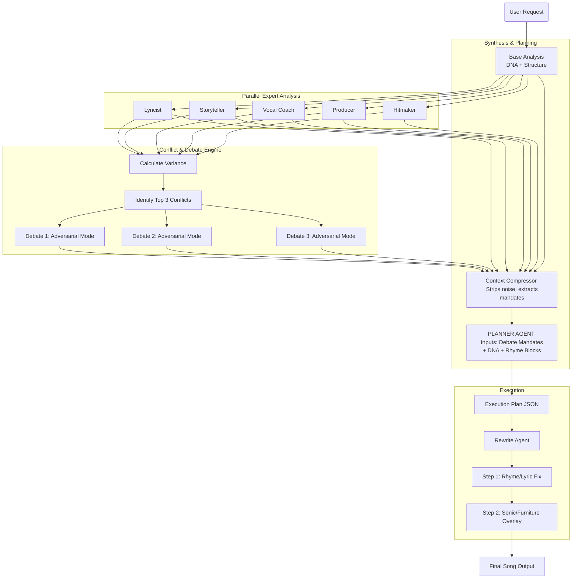

# Gemini 3 Workflow - Part 1: Architectural Analysis & Deep Dive Solutions

**Date:** November 25, 2025  
**Source:** External LLM Consultation (Gemini 3)  
**Context:** Agent Debate System Architecture Workshop  
**Status:** Architecture Proposal - Pending Board Review

---

## Initial Assessment

This is a robust architectural pivot. You are moving from a "simulated assembly line" (parallel, isolated, fake consensus) to a "collaborative agency" (interconnected, adversarial, synthesized).

The biggest risk in your proposed architecture is **Information Overload at the Planner Agent stage**. If we dump raw transcripts, raw DNA analysis, and 5 raw agent outputs into the context window, the model might suffer from "lost in the middle" syndrome or dilute specific instructions.

Let's workshop this architecture to solve three specific high-value problems:

1. **The Rhyme Dependency Problem:** Changing one line usually breaks the rhyme scheme.
2. **The "Agreeable AI" Problem:** Agents tend to be too polite; debates need "teeth."
3. **The "Furniture" Gap:** Non-lyrical elements (ad-libs, breath marks) are often ignored during the actual rewrite.

---

## 🛠️ Deep Dive 1: The "Rhyme Block" Execution Strategy

### The Problem
Your current schema focuses on `lineLevelChanges`.

**Scenario:** The Lyricist wants to change Line A because it's a cliché.

**Result:** The Planner writes a plan to change Line A.

**Failure:** The Rewrite Agent changes Line A, but now it doesn't rhyme with Line B. Or, the agent changes Line B to match A, accidentally removing a hook the Hitmaker loved.

### The Solution: Stanza-Level "Lock & Key"
We must move the atomic unit of change from "Line" to "Rhyme Block" (usually a couplet or a quatrain).

### Architecture Update
Modify the Planner Agent to identify Rhyme Dependencies.

**Updated lineLevelChanges Schema Logic:** Instead of targeting a single line, the Planner targets a `dependencyGroup`.

```typescript
// Inside ExecutionPlan interface
lineLevelChanges: {
  // ... existing fields
  dependencyGroup: number[]; // e.g., [12, 14] - These lines are rhyme-linked
  requiresRhymeUpdate: boolean; // If true, the partner line MUST be updated too
  rhymeSchemeConstraint: string; // e.g., "AABB" or "Perfect Rhyme required"
}[];
```

### Planner Logic Injection
When the Planner accepts a change for Line X:

1. Check structural analysis for Line X's rhyme partner (Line Y).
2. **Constraint:** If Line X changes, Line Y is marked as `Review Required`.
3. **Action:** The Planner explicitly instructs the Rewrite Agent: "You are changing Line X. This breaks the rhyme with Line Y. You must ALSO rewrite Line Y to match the new end-sound of Line X, while preserving the meaning: [Original Meaning]."

---

## 🛠️ Deep Dive 2: "Adversarial Persona" Injection for Debates

### The Problem
LLMs are trained to be helpful and agreeable. In a "Debate," they often jump immediately to "Both sides are valid, let's compromise." This leads to mediocre songs. We need **Dialectic Tension**.

### The Solution: Extreme Persona Constraints
We need to harden the system instructions for the Debate Turns to force distinct viewpoints until the "Synthesizer" turn.

### Architecture Update
Refine the Stage 5 (Agent Debates) prompt engineering.

**Prompt Injection (The "Dissenter" Role):**

```
Role: DISSENTER
Goal: Dismantle the Expert's argument.
Constraint: DO NOT SEEK COMPROMISE. You believe the Expert is ruining the song.
- If Expert argues for "Commercial Appeal," you argue it sounds "Soulless/Plastic."
- If Expert argues for "Lyrical Complexity," you argue it is "Unsingable/Pretentious."
- You must cite specific lyrics that fail your criteria.
```

**Prompt Injection (The "Synthesizer" Role):**

```
Role: SYNTHESIZER
Goal: Pick a WINNER.
Constraint: Compromise is the LAST resort.
- If one argument is structurally superior (backed by DNA or Phonics), that argument WINS.
- If the argument is purely subjective, favor the specific User Preference (e.g. Commercial vs. Artistic).
- Output the "Winning Directive" clearly.
```

---

## 🛠️ Deep Dive 3: The "Sonic Overlay" Pass

### The Problem
You have a specific field for `furnitureAdditions` (visual cues, ad-libs, breathing), but text-generation models often ignore these when asked to write "Lyrics." They see words, not sounds.

### The Solution: The Two-Pass Rewrite
The Rewrite Agent (Stage 10) is doing too much. Splitting it guarantees the "Furniture" gets placed.

### Architecture Update
Split Stage 10 into two micro-steps within the same prompt execution context (Chain of Thought).

**Revised Rewrite Prompt Logic:**

**Pass 1: The Core Rewrite (Lyrics & Rhyme)**  
"Rewrite the lyrics focusing ONLY on the text changes, rhyme preservation, and meter. Do not add brackets or ad-libs yet."

**Pass 2: The Sonic Overlay (Furniture)**  
"Now, take the lyrics you just wrote and apply the 'Furniture Additions' and 'Phonetic Fixes'. Insert [Breath], (Ad-lib), and [Visual Cue] markers exactly where the Storyteller and Vocal Coach requested. Do not change the words, only decorate them."

---

## 🛠️ Deep Dive 4: Context Pruning (The "Briefing Doc")

### The Problem
Sending full JSON objects of 5 analyses + 3 debate transcripts + DNA match to the Planner Agent consumes massive tokens and confuses the model's attention mechanism.

### The Solution: Structured Summarization
Before calling the Planner Agent, run a lightweight "Context Compressor" (programmatic, not AI) to strip the data.

### Architecture Update
Create a `preparePlannerContext` utility.

**Strip the "Reasoning":** For the 5 Agents, the Planner often only needs the score and the `keyInsight`. It doesn't need the paragraph-long justification unless it was part of a Debate.

**Compress the Debates:** Do not send the full 4-turn transcript. Send a Debate Summary Object:

```typescript
interface DebateSummary {
   issue: string;
   winner: 'Lyricist' | 'Hitmaker';
   winningArgument: string; // "Complex metaphors alienate radio listeners"
   agreedAction: string; // "Simplify Chorus lines 3-4, keep Verses complex"
}
```

**Note:** The Planner sees the `agreedAction`, not the argument back-and-forth.

---

## 🚀 Revised Architecture Diagram (Integrated)

This incorporates the Workshop solutions into your Flow.



---

## 📝 Updated PlannerAgent Prompt Strategy

Based on the workshop, here is the refined System Instruction for the Planner Agent to ensure it handles the Rhyme Dependencies and Debate Mandates correctly.

**File:** `services/plannerAgent.ts`

```typescript
const PLANNER_SYSTEM_INSTRUCTION = `
You are the Master Architect of a song. You do not write lyrics; you design the PLAN for the writer.

**CORE DIRECTIVE:**
Synthesize conflicting feedback into a single, cohesive instruction set.

**INPUT PROCESSING RULES:**
1. **Debate Mandates are Absolute:** If the Debate Summary says "Simplify the Chorus," you MUST prioritize that over individual agent scores.
2. **DNA Structure is the Blueprint:** Use the "Structural Lessons" from the DNA match to dictate *pattern* changes (e.g., "The hit song uses a 2-line pre-chorus, we must cut 2 lines").
3. **Rhyme Dependency Awareness:**
   - You cannot request a change to Line A without checking Line B (its rhyme partner).
   - If Line A changes, you must explicitly instruction the modification of Line B to maintain the rhyme scheme.

**OUTPUT STRATEGY:**
Your \`lineLevelChanges\` must be grouped.
- BAD: "Change line 4 to be happier."
- GOOD: "Change lines 3 and 4 (Couplet). Line 3 needs more commercial appeal (Hitmaker). Line 4 must update to rhyme with new Line 3."

**FURNITURE ENFORCEMENT:**
You must explicitly populate the \`furnitureAdditions\` array based on the Storyteller (visuals) and Producer (density).
- If the song is "Low Density," request more ad-libs.
- If the song is "Low Imagery," request concrete nouns in brackets.
`;
```

---

## ✅ Next Step Proposal

Would you like me to rewrite the ExecutionPlan Schema in types.ts to include the new `dependencyGroup` and `requiresRhymeUpdate` fields, and then update the plannerAgent.ts code to utilize context compression?

---

**End of Part 1**
